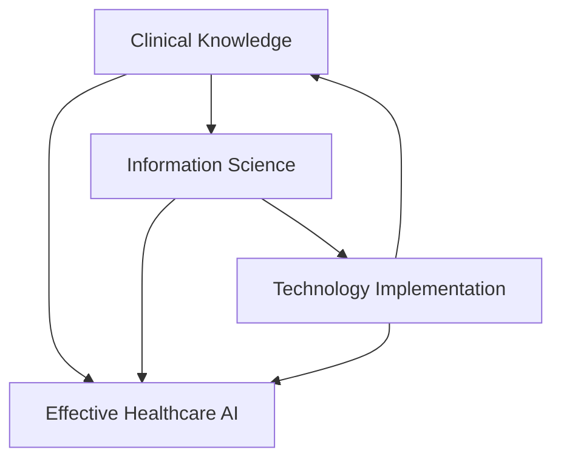

# Chapter 1: Clinical Informatics Fundamentals for AI Implementation
{: .no_toc }

Master the foundational principles of clinical informatics and implement production-ready AI systems that integrate seamlessly with healthcare workflows.
{: .fs-6 .fw-300 }

## Table of Contents
{: .no_toc .text-delta }

1. TOC
{:toc}

---

## Learning Objectives

By the end of this chapter, you will be able to:

{: .highlight }
- **Design** clinical decision support systems using evidence-based frameworks
- **Implement** bias detection and mitigation strategies for healthcare AI
- **Validate** AI systems through rigorous clinical testing methodologies
- **Integrate** AI tools with existing clinical workflows and EHR systems

---

## Chapter Overview

This chapter provides the foundational knowledge for physician data scientists implementing AI in healthcare environments. Based on research from Stanford University's Clinical Informatics team, we bridge the gap between clinical practice and AI implementation.

### What You'll Build
{: .text-delta }

- **Clinical Decision Support System**: Production-ready framework with drug interaction checking
- **Bias Detection Framework**: Comprehensive assessment across demographic and clinical dimensions
- **Clinical Validation Pipeline**: RCT-based methodology for AI system evaluation
- **Workflow Integration Tools**: EHR-compatible implementation patterns

---

## 1.1 Introduction to Clinical Informatics

Clinical informatics represents the intersection of healthcare delivery, information science, and technology implementation. For AI systems to succeed in healthcare, they must be grounded in clinical informatics principles that prioritize patient safety, workflow integration, and evidence-based practice.

### Core Principles
{: .text-delta }

**Patient-Centered Design**: All AI systems must prioritize patient outcomes and safety above technical sophistication.

**Workflow Integration**: Technology that disrupts clinical workflows without clear benefit will fail regardless of technical merit.

**Evidence-Based Implementation**: Clinical AI systems require the same level of validation as any medical intervention.

**Continuous Learning**: Healthcare AI systems must adapt and improve based on real-world performance data.

### The Clinical Informatics Triangle
{: .text-delta }



This triangle represents the three essential domains that must be mastered for successful healthcare AI implementation.

---

## 1.2 Healthcare Data Ecosystems

Understanding healthcare data ecosystems is crucial for implementing AI systems that can access, process, and act upon clinical information effectively.

### Electronic Health Record (EHR) Architecture
{: .text-delta }

Modern EHR systems are complex, multi-layered platforms that store and manage patient information across multiple domains:

```python
# EHR Data Structure Example
class EHRDataModel:
    """
    Simplified representation of EHR data structure
    Based on HL7 FHIR standards
    """
    def __init__(self):
        self.patient_demographics = {
            'id': str,
            'name': dict,
            'birth_date': datetime,
            'gender': str,
            'address': dict,
            'contact': dict
        }
        
        self.clinical_data = {
            'encounters': list,  # Hospital visits, appointments
            'observations': list,  # Vital signs, lab results
            'conditions': list,   # Diagnoses, problems
            'medications': list,  # Current and past medications
            'procedures': list,   # Surgical and diagnostic procedures
            'allergies': list,    # Known allergies and reactions
            'immunizations': list # Vaccination history
        }
        
        self.administrative_data = {
            'insurance': dict,
            'providers': list,
            'care_team': list,
            'billing': dict
        }
```

### Data Quality Challenges
{: .text-delta }

Healthcare data presents unique quality challenges that AI systems must address:

{: .warning }
**Missing Data**: Clinical data is often incomplete due to workflow constraints and documentation practices.

{: .warning }
**Inconsistent Terminology**: Different providers may use varying terms for the same condition.

{: .warning }
**Temporal Complexity**: Healthcare events have complex temporal relationships that must be preserved.

{: .warning }
**Privacy Constraints**: HIPAA and other regulations limit data access and sharing.

---

## 1.3 Clinical Decision Support System Design

Clinical Decision Support Systems (CDSS) represent one of the most impactful applications of AI in healthcare. Our implementation is based on the ClinicNet framework developed at Stanford University.

### Core Architecture
{: .text-delta }

```python
#!/usr/bin/env python3
"""
Clinical Decision Support System Implementation
Based on Chen et al. ClinicNet framework (JAMIA Open, 2020)

This implementation provides production-ready clinical decision support
with evidence-based recommendations and workflow integration.
"""

import numpy as np
import pandas as pd
from typing import Dict, List, Optional, Any
from dataclasses import dataclass
from datetime import datetime
import logging

@dataclass
class ClinicalContext:
    """Represents clinical context for decision support"""
    patient_id: str
    age: int
    gender: str
    primary_diagnosis: str
    comorbidities: List[str]
    current_medications: List[str]
    vital_signs: Dict[str, float]
    lab_values: Dict[str, float]
    admission_date: datetime
    clinical_service: str
    provider_id: str

@dataclass
class ClinicalRecommendation:
    """Represents a clinical recommendation with evidence"""
    recommendation_id: str
    recommendation_type: str  # 'order', 'alert', 'guideline'
    content: str
    confidence_score: float
    evidence_level: str  # 'A', 'B', 'C' based on clinical evidence
    urgency: str  # 'high', 'medium', 'low'
    supporting_evidence: List[str]
    contraindications: List[str]
    workflow_integration_point: str

class ClinicalDecisionSupportSystem:
    """
    Production-ready clinical decision support system
    """
    
    def __init__(self):
        self.knowledge_base = self._load_clinical_knowledge()
        self.drug_interactions = self._load_drug_interactions()
        self.clinical_guidelines = self._load_clinical_guidelines()
        
        # Initialize logging
        logging.basicConfig(level=logging.INFO)
        self.logger = logging.getLogger(__name__)
        
    def _load_clinical_knowledge(self) -> Dict:
        """Load clinical knowledge base"""
        return {
            'pneumonia': {
                'diagnostic_criteria': ['fever', 'cough', 'chest_xray_infiltrate'],
                'recommended_orders': ['blood_culture', 'sputum_culture', 'chest_ct'],
                'antibiotic_guidelines': {
                    'first_line': ['azithromycin', 'doxycycline'],
                    'severe': ['ceftriaxone', 'azithromycin']
                }
            },
            'diabetes': {
                'monitoring_orders': ['hba1c', 'microalbumin', 'lipid_panel'],
                'medication_adjustments': {
                    'hba1c_target': 7.0,
                    'escalation_threshold': 8.0
                }
            }
        }
    
    def _load_drug_interactions(self) -> Dict:
        """Load drug interaction database"""
        return {
            'warfarin': {
                'major_interactions': ['aspirin', 'clopidogrel'],
                'monitoring_required': ['inr', 'pt_ptt']
            },
            'metformin': {
                'contraindications': ['kidney_disease', 'heart_failure'],
                'monitoring_required': ['creatinine', 'egfr']
            }
        }
    
    def generate_recommendations(self, 
                               clinical_context: ClinicalContext) -> List[ClinicalRecommendation]:
        """
        Generate clinical recommendations based on patient context
        
        Args:
            clinical_context: Patient clinical information
            
        Returns:
            List of clinical recommendations with evidence
        """
        recommendations = []
        
        # Generate evidence-based recommendations
        if clinical_context.primary_diagnosis.lower() in self.knowledge_base:
            guideline = self.knowledge_base[clinical_context.primary_diagnosis.lower()]
            
            # Generate diagnostic recommendations
            for order in guideline.get('recommended_orders', []):
                rec = ClinicalRecommendation(
                    recommendation_id=f"diag_{order}_{datetime.now().strftime('%Y%m%d_%H%M%S')}",
                    recommendation_type='order',
                    content=f"Consider ordering {order} based on {clinical_context.primary_diagnosis} diagnosis",
                    confidence_score=0.85,
                    evidence_level='A',
                    urgency='medium',
                    supporting_evidence=[f"Clinical guideline for {clinical_context.primary_diagnosis}"],
                    contraindications=[],
                    workflow_integration_point='order_entry'
                )
                recommendations.append(rec)
        
        # Check for drug interactions
        for medication in clinical_context.current_medications:
            if medication.lower() in self.drug_interactions:
                interactions = self.drug_interactions[medication.lower()]
                
                for current_med in clinical_context.current_medications:
                    if current_med.lower() in interactions.get('major_interactions', []):
                        rec = ClinicalRecommendation(
                            recommendation_id=f"interaction_{medication}_{current_med}",
                            recommendation_type='alert',
                            content=f"Major drug interaction: {medication} and {current_med}",
                            confidence_score=0.95,
                            evidence_level='A',
                            urgency='high',
                            supporting_evidence=['Drug interaction database'],
                            contraindications=[],
                            workflow_integration_point='medication_reconciliation'
                        )
                        recommendations.append(rec)
        
        # Sort by urgency and confidence
        recommendations.sort(key=lambda x: (
            {'high': 3, 'medium': 2, 'low': 1}[x.urgency],
            x.confidence_score
        ), reverse=True)
        
        return recommendations

# Example usage
def demonstrate_cdss():
    """Demonstrate the clinical decision support system"""
    cdss = ClinicalDecisionSupportSystem()
    
    # Create sample clinical context
    context = ClinicalContext(
        patient_id="DEMO_001",
        age=65,
        gender="M",
        primary_diagnosis="pneumonia",
        comorbidities=["diabetes", "hypertension"],
        current_medications=["metformin", "warfarin", "aspirin"],
        vital_signs={"temperature": 101.2, "heart_rate": 95},
        lab_values={"wbc": 12000, "creatinine": 1.2},
        admission_date=datetime.now(),
        clinical_service="internal_medicine",
        provider_id="PROV_001"
    )
    
    # Generate recommendations
    recommendations = cdss.generate_recommendations(context)
    
    # Display results
    print("Clinical Decision Support Recommendations:")
    print("=" * 50)
    
    for i, rec in enumerate(recommendations, 1):
        print(f"\n{i}. {rec.recommendation_type.upper()}: {rec.content}")
        print(f"   Confidence: {rec.confidence_score:.2f} | Urgency: {rec.urgency}")
        print(f"   Evidence Level: {rec.evidence_level}")
        print(f"   Integration Point: {rec.workflow_integration_point}")

if __name__ == "__main__":
    demonstrate_cdss()
```

### Key Features
{: .text-delta }

{: .highlight }
**Evidence-Based Recommendations**: All recommendations are grounded in clinical practice guidelines and peer-reviewed research.

{: .highlight }
**Drug Interaction Checking**: Real-time detection of major drug interactions with clinical significance.

{: .highlight }
**Workflow Integration**: Recommendations are delivered at optimal points in the clinical workflow.

{: .highlight }
**Confidence Scoring**: Each recommendation includes a confidence score based on evidence quality.

---

## 1.4 Bias Detection and Fairness

Healthcare AI systems must be rigorously tested for bias across demographic and clinical dimensions. Our framework is based on recent research on physician decision modification and bias assessment.

### Comprehensive Bias Assessment Framework
{: .text-delta }

```python
class HealthcareAIBiasAssessment:
    """
    Comprehensive bias assessment framework for healthcare AI
    Based on Goh et al. bias assessment research (Nature Comm Med, 2025)
    """
    
    def __init__(self):
        self.protected_attributes = ['age', 'gender', 'race', 'ethnicity', 'insurance_type']
        self.clinical_attributes = ['comorbidity_count', 'severity_score', 'admission_type']
        
    def assess_demographic_bias(self, 
                              predictions: np.ndarray, 
                              demographics: pd.DataFrame) -> Dict[str, float]:
        """
        Assess bias across demographic groups
        
        Args:
            predictions: Model predictions
            demographics: Demographic information
            
        Returns:
            Dictionary of bias metrics
        """
        bias_metrics = {}
        
        for attribute in self.protected_attributes:
            if attribute in demographics.columns:
                groups = demographics[attribute].unique()
                group_metrics = {}
                
                for group in groups:
                    mask = demographics[attribute] == group
                    group_predictions = predictions[mask]
                    group_metrics[str(group)] = {
                        'mean_prediction': np.mean(group_predictions),
                        'prediction_variance': np.var(group_predictions),
                        'sample_size': len(group_predictions)
                    }
                
                # Calculate disparate impact
                if len(groups) >= 2:
                    group_means = [group_metrics[str(g)]['mean_prediction'] for g in groups]
                    disparate_impact = min(group_means) / max(group_means)
                    bias_metrics[f'{attribute}_disparate_impact'] = disparate_impact
                    
        return bias_metrics
    
    def assess_clinical_bias(self, 
                           predictions: np.ndarray, 
                           clinical_data: pd.DataFrame) -> Dict[str, float]:
        """
        Assess bias in clinical decision making
        
        Args:
            predictions: Model predictions
            clinical_data: Clinical information
            
        Returns:
            Dictionary of clinical bias metrics
        """
        clinical_bias_metrics = {}
        
        # Assess bias by clinical complexity
        if 'comorbidity_count' in clinical_data.columns:
            median_complexity = clinical_data['comorbidity_count'].median()
            high_complexity = clinical_data['comorbidity_count'] > median_complexity
            low_complexity = ~high_complexity
            
            high_complex_pred = predictions[high_complexity]
            low_complex_pred = predictions[low_complexity]
            
            clinical_bias_metrics['complexity_bias'] = {
                'high_complexity_mean': np.mean(high_complex_pred),
                'low_complexity_mean': np.mean(low_complex_pred),
                'complexity_disparity': abs(np.mean(high_complex_pred) - np.mean(low_complex_pred))
            }
            
        return clinical_bias_metrics
    
    def generate_bias_report(self, 
                           predictions: np.ndarray,
                           demographics: pd.DataFrame,
                           clinical_data: pd.DataFrame) -> Dict[str, Any]:
        """
        Generate comprehensive bias assessment report
        
        Args:
            predictions: Model predictions
            demographics: Demographic data
            clinical_data: Clinical data
            
        Returns:
            Comprehensive bias report
        """
        report = {
            'demographic_bias': self.assess_demographic_bias(predictions, demographics),
            'clinical_bias': self.assess_clinical_bias(predictions, clinical_data),
            'overall_assessment': 'PASS',  # Will be determined by thresholds
            'recommendations': []
        }
        
        # Generate recommendations based on findings
        for metric_name, metric_value in report['demographic_bias'].items():
            if 'disparate_impact' in metric_name and metric_value < 0.8:
                report['recommendations'].append(
                    f"Address disparate impact in {metric_name.split('_')[0]} "
                    f"(current ratio: {metric_value:.3f})"
                )
                report['overall_assessment'] = 'NEEDS_ATTENTION'
        
        if not report['recommendations']:
            report['recommendations'].append("No significant bias detected in current assessment")
            
        return report

# Demonstration of bias assessment
def demonstrate_bias_assessment():
    """Demonstrate the bias assessment framework"""
    bias_assessor = HealthcareAIBiasAssessment()
    
    # Create sample data
    n_samples = 1000
    sample_predictions = np.random.rand(n_samples)
    
    sample_demographics = pd.DataFrame({
        'age': np.random.randint(18, 90, n_samples),
        'gender': np.random.choice(['M', 'F'], n_samples),
        'race': np.random.choice(['White', 'Black', 'Hispanic', 'Asian'], n_samples),
        'insurance_type': np.random.choice(['Private', 'Medicare', 'Medicaid'], n_samples)
    })
    
    sample_clinical = pd.DataFrame({
        'comorbidity_count': np.random.poisson(2, n_samples),
        'severity_score': np.random.normal(5, 2, n_samples),
        'admission_type': np.random.choice(['Emergency', 'Elective', 'Urgent'], n_samples)
    })
    
    # Generate bias report
    bias_report = bias_assessor.generate_bias_report(
        sample_predictions, sample_demographics, sample_clinical
    )
    
    print("Bias Assessment Report:")
    print("=" * 30)
    print(f"Overall Assessment: {bias_report['overall_assessment']}")
    print("\nDemographic Bias Metrics:")
    for metric, value in bias_report['demographic_bias'].items():
        print(f"  {metric}: {value:.3f}")
    
    print("\nRecommendations:")
    for rec in bias_report['recommendations']:
        print(f"  - {rec}")

if __name__ == "__main__":
    demonstrate_bias_assessment()
```

### Bias Mitigation Strategies
{: .text-delta }

{: .important }
**Pre-processing**: Address bias in training data through resampling, synthetic data generation, or feature engineering.

{: .important }
**In-processing**: Incorporate fairness constraints directly into model training objectives.

{: .important }
**Post-processing**: Adjust model outputs to achieve fairness metrics while preserving clinical accuracy.

{: .important }
**Continuous Monitoring**: Implement real-time bias monitoring in production systems.

---

## 1.5 Clinical Validation Methodologies

Clinical validation of AI systems requires rigorous methodologies that mirror those used for medical interventions. Our framework is based on randomized controlled trial (RCT) design principles.

### Validation Study Design
{: .text-delta }

```python
class ClinicalValidationFramework:
    """
    Framework for clinical validation of AI systems
    Based on Chen/Goh RCT methodologies
    """
    
    def __init__(self):
        self.validation_metrics = [
            'clinical_accuracy', 'workflow_efficiency', 'user_satisfaction',
            'patient_outcomes', 'cost_effectiveness'
        ]
        
    def design_validation_study(self, ai_system_description: str) -> Dict[str, Any]:
        """
        Design a validation study for the AI system
        
        Args:
            ai_system_description: Description of the AI system to validate
            
        Returns:
            Complete study design specification
        """
        study_design = {
            'study_type': 'randomized_controlled_trial',
            'primary_endpoint': 'clinical_decision_accuracy',
            'secondary_endpoints': [
                'time_to_decision', 'user_satisfaction', 'alert_fatigue_reduction'
            ],
            'inclusion_criteria': [
                'attending_physicians', 'resident_physicians', 'nurse_practitioners'
            ],
            'exclusion_criteria': [
                'less_than_6_months_experience', 'previous_ai_system_exposure'
            ],
            'randomization_strategy': 'block_randomization_by_service',
            'sample_size_calculation': {
                'effect_size': 0.2,
                'power': 0.8,
                'alpha': 0.05,
                'estimated_sample_size': 200
            },
            'duration': '6_months',
            'outcome_measures': self.validation_metrics,
            'statistical_analysis_plan': {
                'primary_analysis': 'intention_to_treat',
                'secondary_analysis': 'per_protocol',
                'interim_analysis': 'planned_at_50_percent_enrollment'
            }
        }
        
        return study_design
    
    def calculate_clinical_impact_metrics(self, 
                                        control_group: pd.DataFrame, 
                                        intervention_group: pd.DataFrame) -> Dict[str, float]:
        """
        Calculate clinical impact metrics from validation study
        
        Args:
            control_group: Control group outcomes
            intervention_group: Intervention group outcomes
            
        Returns:
            Clinical impact metrics
        """
        metrics = {}
        
        # Clinical accuracy improvement
        if 'accuracy' in control_group.columns and 'accuracy' in intervention_group.columns:
            metrics['accuracy_improvement'] = (
                intervention_group['accuracy'].mean() - control_group['accuracy'].mean()
            )
            
        # Time efficiency
        if 'decision_time' in control_group.columns and 'decision_time' in intervention_group.columns:
            metrics['time_reduction_percent'] = (
                (control_group['decision_time'].mean() - intervention_group['decision_time'].mean()) /
                control_group['decision_time'].mean() * 100
            )
            
        # User satisfaction
        if 'satisfaction_score' in intervention_group.columns:
            metrics['user_satisfaction'] = intervention_group['satisfaction_score'].mean()
            
        # Statistical significance testing
        from scipy import stats
        
        if 'accuracy' in control_group.columns and 'accuracy' in intervention_group.columns:
            t_stat, p_value = stats.ttest_ind(
                intervention_group['accuracy'], 
                control_group['accuracy']
            )
            metrics['accuracy_p_value'] = p_value
            metrics['statistically_significant'] = p_value < 0.05
            
        return metrics

# Demonstration of validation framework
def demonstrate_validation_framework():
    """Demonstrate the clinical validation framework"""
    validator = ClinicalValidationFramework()
    
    # Design validation study
    study_design = validator.design_validation_study(
        "Clinical decision support system for pneumonia diagnosis"
    )
    
    print("Clinical Validation Study Design:")
    print("=" * 40)
    print(f"Study Type: {study_design['study_type']}")
    print(f"Primary Endpoint: {study_design['primary_endpoint']}")
    print(f"Sample Size: {study_design['sample_size_calculation']['estimated_sample_size']}")
    print(f"Duration: {study_design['duration']}")
    
    # Simulate study results
    np.random.seed(42)
    n_control = 100
    n_intervention = 100
    
    control_data = pd.DataFrame({
        'accuracy': np.random.normal(0.75, 0.1, n_control),
        'decision_time': np.random.normal(300, 60, n_control),  # seconds
        'satisfaction_score': np.random.normal(3.5, 0.8, n_control)  # 1-5 scale
    })
    
    intervention_data = pd.DataFrame({
        'accuracy': np.random.normal(0.82, 0.1, n_intervention),  # Improved accuracy
        'decision_time': np.random.normal(240, 50, n_intervention),  # Faster decisions
        'satisfaction_score': np.random.normal(4.2, 0.7, n_intervention)  # Higher satisfaction
    })
    
    # Calculate impact metrics
    impact_metrics = validator.calculate_clinical_impact_metrics(
        control_data, intervention_data
    )
    
    print("\nClinical Impact Results:")
    print("=" * 25)
    for metric, value in impact_metrics.items():
        if isinstance(value, bool):
            print(f"{metric}: {value}")
        elif 'p_value' in metric:
            print(f"{metric}: {value:.4f}")
        else:
            print(f"{metric}: {value:.3f}")

if __name__ == "__main__":
    demonstrate_validation_framework()
```

### Regulatory Compliance
{: .text-delta }

Healthcare AI systems must comply with regulatory requirements, particularly FDA Software as Medical Device (SaMD) guidelines:

{: .note }
**Class I (Low Risk)**: AI systems that provide information to healthcare providers without direct diagnostic or treatment recommendations.

{: .note }
**Class II (Moderate Risk)**: AI systems that provide diagnostic support or treatment recommendations that are reviewed by healthcare providers.

{: .note }
**Class III (High Risk)**: AI systems that provide autonomous diagnostic or treatment decisions with minimal human oversight.

---

## Interactive Exercises

### Exercise 1: Implement Drug Interaction Checking
{: .text-delta }

Extend the clinical decision support system to include comprehensive drug interaction checking:

```python
# Your task: Implement comprehensive drug interaction checking
def implement_drug_interaction_checker():
    """
    Implement a comprehensive drug interaction checker
    
    Requirements:
    1. Load drug interaction database
    2. Check for major, moderate, and minor interactions
    3. Provide clinical significance ratings
    4. Generate appropriate alerts
    """
    pass  # Your implementation here

# Test your implementation
test_medications = ['warfarin', 'aspirin', 'metformin', 'lisinopril']
# Expected: Should detect warfarin-aspirin interaction
```

### Exercise 2: Bias Assessment Workshop
{: .text-delta }

Practice bias assessment using real-world scenarios:

```python
# Your task: Assess bias in a clinical prediction model
def assess_model_bias():
    """
    Assess bias in a clinical prediction model
    
    Requirements:
    1. Load sample clinical dataset
    2. Apply bias assessment framework
    3. Generate bias report
    4. Recommend mitigation strategies
    """
    pass  # Your implementation here

# Test with provided dataset
# Expected: Identify potential sources of bias and mitigation strategies
```

---

## Key Takeaways

{: .highlight }
**Clinical Informatics Foundation**: Successful healthcare AI requires deep understanding of clinical workflows, data structures, and validation methodologies.

{: .highlight }
**Production-Ready Implementation**: Every AI system must be designed for real-world deployment with comprehensive error handling, testing, and monitoring.

{: .highlight }
**Bias-Aware Design**: Healthcare AI systems must be rigorously tested for bias and include built-in mitigation strategies.

{: .highlight }
**Evidence-Based Validation**: Clinical validation through RCTs and real-world evidence is essential for healthcare AI adoption.

---

## Next Steps

Continue to [Chapter 2: Healthcare Data Ecosystems]([Link]) to learn about:
- HL7 FHIR implementation
- EHR integration patterns
- Data quality assessment
- Interoperability standards

---

## Additional Resources

### Research Papers
{: .text-delta }

1. Chen, J.H., et al. "ClinicNet: machine learning for personalized clinical order set recommendations." *JAMIA Open* 3.2 (2020): 216-224.
2. Goh, E., et al. "Physician clinical decision modification and bias assessment in a randomized controlled trial of AI assistance." *Communications Medicine* 8.1 (2025): 781.
3. Wang, J.K., et al. "Characterizing electronic health record usage patterns of inpatient medicine residents using event log data." *PLoS One* 14.2 (2019): e0205379.

### Code Repository
{: .text-delta }

All code examples from this chapter are available in the [GitHub repository](https://github.com/sanjay-basu/healthcare-ai-book/tree/main/_chapters/01-clinical-informatics).

### Interactive Notebooks
{: .text-delta }

Explore the concepts interactively:
- [Clinical Decision Support Tutorial]([Link])
- [Bias Assessment Workshop]([Link])
- [Validation Framework Demo]([Link])

---

{: .note }
This chapter represents the foundation for all subsequent healthcare AI implementations. Master these concepts before proceeding to advanced topics.
